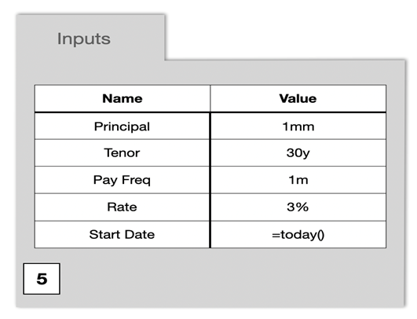

.. Disent Spread Book documentation master file, created by
	sphinx-quickstart on Fri Aug 12 06:29:54 2022.
	You can adapt this file completely to your liking, but it should at least
	contain the root `toctree` directive.

Welcome to Disent Spread Book's documentation!
==============================================

.. toctree::
	:maxdepth: 2
	:caption: Contents:

Amortization Schedule
=====================

You are considering a mortgage and you would like to generate an amortization schedule.
Choose the Amortization Schedule example from the spread book home page.
(internal note: assumption is that the example is ready to go)

You need to input parameters in the Spread Book and expect 4 outputs, amortization schedule table, Zero Rate Curve, Discounted Cash Flows and Mortgage Summary.

How much is the house?... let’s call this Principal, let’s input 1mm (mm will convert to millions)

What is the interest rate?... let’s put the Rate as 3%

How often do you pay?.... put down as date period, such as 1m

How long is the mortgage?... Put down as date period, such as 30y

When would the mortgage start?... you can use a formula such as today()

The back-end python code would be 

.. code-block:: python3

	# If you do not enter inputs, it will take default values start date, Tenor, Payment Frequency, Rate, Principal as Today, 30 years,
	# monthly, 3% and 750,000$
	Inputs.Start_Date = disent_input('Inputs', 'Start Date',default=datetime.date.today()	,dtype=datetime.datetime)
	Inputs.Tenor = 		disent_input('Inputs', 'Tenor',		default=rd(years=30)				,dtype=rd)
	Inputs.PayFreq = 	disent_input('Inputs', 'PayFreq',	default=rd(months=1)			,dtype=rd)
	Inputs.Rate = 		disent_input('Inputs', 'Rate',		default=0.03				,dtype=types.pct)
	Inputs.Principal = 	disent_input('Inputs', 'Principal',	default=750e3				,dtype=types.ccy('USD'))

Now What>? ... We create an amortization function 'mort'.

.. code-block:: python3

	pmts = []

	def mort(P,a,n,freq,i,pmts=[]):

		# initial balance at principal amount
		balance = P
		
		# iterate through each payment period
		for t in range(freq,(n+1)*freq):
			
		# evaluate interest using previous period balance
		interest = balance * i/freq
		
		# compute principal payment from payment - interest
		principal = a - interest
		
		# compute new balance after this period's principal payment
		balance = balance - principal

		# turn payment period number "t" into actual payment date
		paydate = Inputs.Start_Date+Inputs.PayFreq*(t+1)

		# create dictionary of values for the current period, and append to payments list
		d = {'Pays':paydate,'Balance':balance,'Interest':interest,'Payment':a,'Principal':principal}
		pmts.append(d)
		
		if balance <=0:
			break
	
	return balance

The mort function calculates the amortization schedule. 
The reason that the function returns balance is that it is also used to calculate payment value at each payment frequency. 
The following code passes payment value to mort function until it finds the right payment value which makes the last balance equals zero.

.. .. code-block:: python3
.. 	n = int(round(dates.yearfrac(Inputs.Tenor),0))
.. # freq = int(1/dates.yearfrac(Inputs.PayFreq))
.. freq = int(round(1/dates.yearfrac(Inputs.PayFreq),0))
.. # Lambda function 'mort_a' gets payment value as 'a' and passes into 'mort' function
.. mort_a = lambda a: mort(Inputs.Principal,a,n,freq,Inputs.Rate,pmts=pmts)
.. # The following code iterate payment value into the lambda function 'mort_a' until it gets the right payment value
.. # which lets the last balance equals 0. Then it returns the amortization schedule
.. A = dscipy_root(mort_a,1)
.. 	pmts = []
.. 	mort_a(A)
.. 	df = pd.DataFrame(pmts)
.. 	Amortization_Schedule = disent_dataframe(df)

.. The Amortization Schedule would look like the following chart

.. .. figure:: source/Amortization.png
.. 	:align: center
.. 	:scale: 75 %
.. 	:alt: Inputs

.. Now you want to see the discounted cash flows and the return of the mortgage. 
.. First you need the Zero Rate Curve. 
.. .. code-block:: python3
.. 	Spot_Curve = disent_spreadbook('USD LIBOR 3M Zero Curve',columns=['Pillar','Zero Rate','Disc Factor'])

.. Disent_spreadbook is a disent function which will provide zero rate curve. The calculation formula has been encapsulated in the function.

.. .. figure:: source/ZeroRate.png
.. 	:align: center
.. 	:scale: 75 %
.. 	:alt: Inputs

.. In the Zero Rate Curve, the column Zero_Rate and Disc_Factor have 1 day, 3months, 6months, 9 months and 10 months value. 
.. When the zero-rate pillar is not exactly these months, we use python interpolation to find the corresponding zero rates. 
.. For instance, if we want to use 2months zero-rate, we would interpolate between 1day zero-rate and 3months rate to find the 2months zero-rate.

.. Then, you use the following code to create the Discounted Cash Flows. Because you would like to see the actual present value of your future cash flows.
.. .. code-block:: python3
.. 	# Proceeds at first date

.. 	Proceeds = disent_table()
.. 	Proceeds.Pays = Inputs.Start_Date
.. 	Proceeds.Flow = -Inputs.Principal
.. 	# print(Proceeds)

.. 	# PV's
.. 	# Add Payment dates, Cash Flow and Discount Factor
.. 	PVs = disent_table()
.. 	PVs.Pays = np.concatenate((Proceeds.Pays,Amortization_Schedule.Pays))
.. 	PVs.Flow = np.concatenate((Proceeds.Flow,Amortization_Schedule.Payment))
.. 	# Interpolate Zero Rate Curve to find the corresponding discount factor of the payment frequency
.. 	PVs.Disc_Factor = dscipy.interp1d(Globals.Horizon+Spot_Curve.Pillar,Spot_Curve.Disc_Factor,kind='linear',fill_value='extrapolate')(PVs.Pays)
.. 	PVs.PV = PVs.Disc_Factor * PVs.Flow
.. 	print(PVs.df())

.. Disent_table is a pandas dataframe. 
.. The Discounted Cash Flow output would look like below. 
.. As you can see, present value of the cash flows differs although cash flows are same. 
.. Because Present value of Cash Flow=Cash Flow*Discount Factor, where discount factor has different value on each payment frequency.
