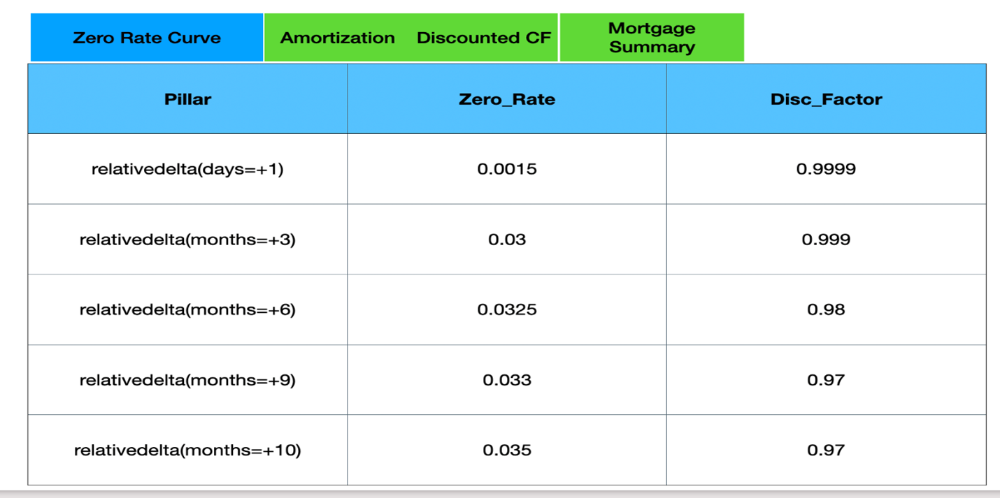
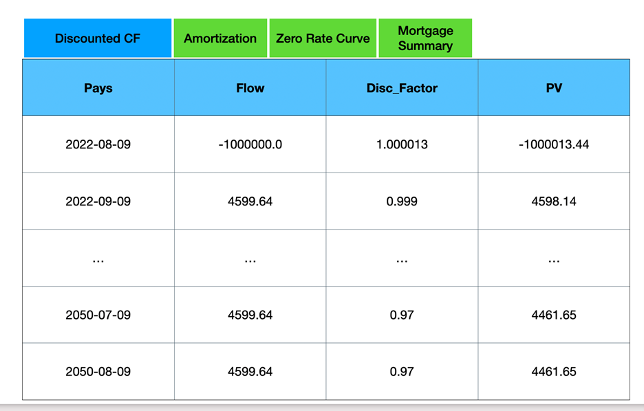
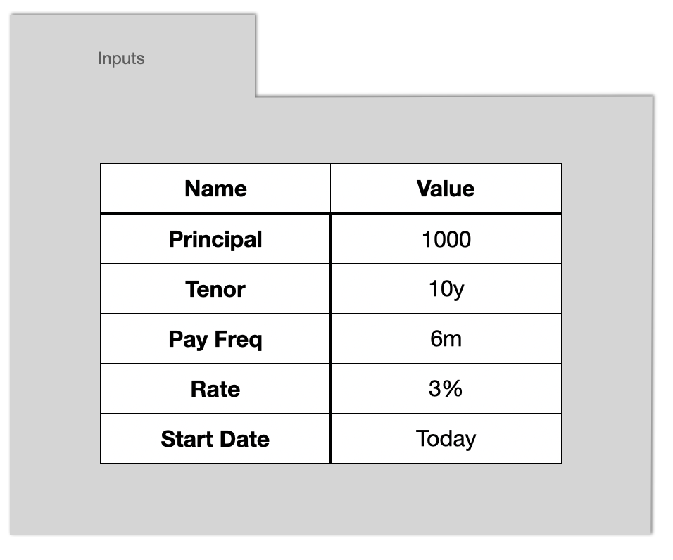
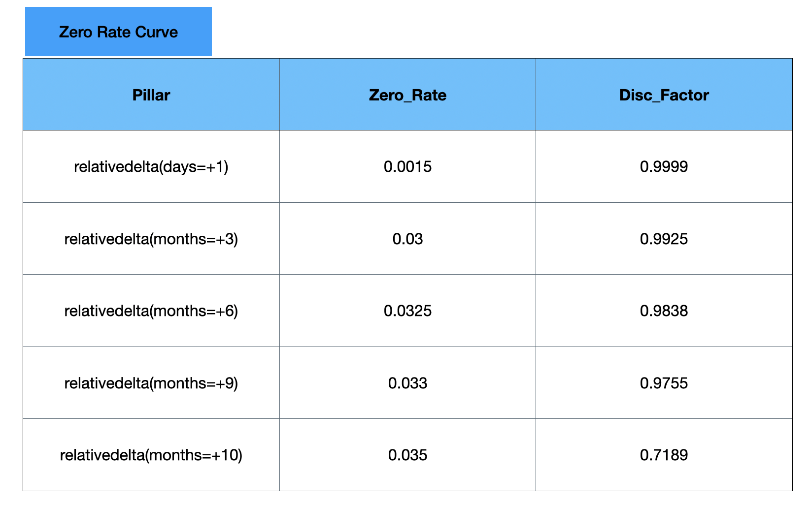
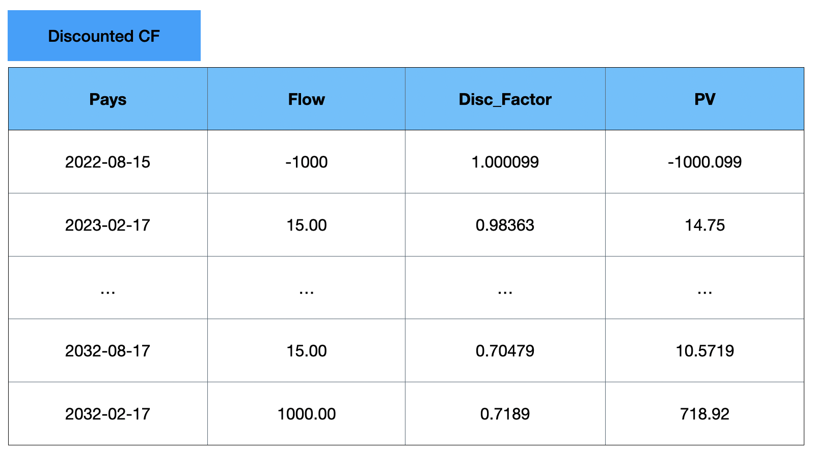

.. Disent Spread Book documentation master file, created by
	sphinx-quickstart on Fri Aug 12 06:29:54 2022.
	You can adapt this file completely to your liking, but it should at least
	contain the root `toctree` directive.

Welcome to Disent Spread Book's documentation!
==============================================

.. toctree::
	:maxdepth: 2
	:caption: Contents:

Amortization Schedule
=====================

You are considering a mortgage and you would like to generate an amortization schedule.
Choose the Amortization Schedule example from the spread book home page.
(internal note: assumption is that the example is ready to go)

You need to input parameters in the Spread Book and expect 4 outputs: amortization schedule table, Zero Rate Curve, Discounted Cash Flows and Mortgage Summary.

How much is the house?... let’s call this Principal, let’s input 1mm (mm will convert to millions)

What is the interest rate?... let’s put the Rate as 3%

How often do you pay?.... put down as date period, such as 1m

How long is the mortgage?... Put down as date period, such as 30y

When would the mortgage start?... you can use a formula such as today()

.. figure:: source/inputs1.png
	:align: center
	:scale: 75 %
	:alt: Inputs

The back-end python code would be 

.. code-block:: python3

	# If you do not enter inputs, it will take default values start date, Tenor, Payment Frequency, Rate, Principal as Today, 30 years,
	# monthly, 3% and 750,000$
	Inputs.Start_Date = disent_input('Inputs', 'Start Date',default=datetime.date.today()	,dtype=datetime.datetime)
	Inputs.Tenor = 		disent_input('Inputs', 'Tenor',		default=rd(years=30)				,dtype=rd)
	Inputs.PayFreq = 	disent_input('Inputs', 'PayFreq',	default=rd(months=1)			,dtype=rd)
	Inputs.Rate = 		disent_input('Inputs', 'Rate',		default=0.03				,dtype=types.pct)
	Inputs.Principal = 	disent_input('Inputs', 'Principal',	default=750e3				,dtype=types.ccy('USD'))

	[Inputs] Start Date: today()
	[Inputs] Tenor: 30y
	[Inputs] PayFreq: 1m
	[Inputs] Rate: 0.03
	[Inputs] Principal: 1000000

Now What? ... We create an amortization function 'mort'.

.. code-block:: python3

	pmts = []

	def mort(P,a,n,freq,i,pmts=[]):

		# initial balance at principal amount
		balance = P
		
		# iterate through each payment period
		for t in range(freq,(n+1)*freq):
			
		# evaluate interest using previous period balance
		interest = balance * i/freq
		
		# compute principal payment from payment - interest
		principal = a - interest
		
		# compute new balance after this period's principal payment
		balance = balance - principal

		# turn payment period number "t" into actual payment date
		paydate = Inputs.Start_Date+Inputs.PayFreq*(t+1)

		# create dictionary of values for the current period, and append to payments list
		d = {'Pays':paydate,'Balance':balance,'Interest':interest,'Payment':a,'Principal':principal}
		pmts.append(d)
		
		if balance <=0:
			break
	
	return balance

The mort function calculates the amortization schedule. 
The reason that the function returns balance is that it is also used to calculate payment value at each payment frequency. 
The following code passes payment value to mort function until it finds the right payment value which makes the last balance equal zero.

.. code-block:: python3

	n = int(round(dates.yearfrac(Inputs.Tenor),0))
	# freq = int(1/dates.yearfrac(Inputs.PayFreq))
	freq = int(round(1/dates.yearfrac(Inputs.PayFreq),0))
	# Lambda function 'mort_a' gets payment value as 'a' and passes into 'mort' function
	mort_a = lambda a: mort(Inputs.Principal,a,n,freq,Inputs.Rate,pmts=pmts)
	# The following code iterates payment value into the lambda function 'mort_a' until it gets the right payment value
	# which lets the last balance equal 0. Then it returns the amortization schedule
	A = dscipy_root(mort_a,1)
	pmts = []
	mort_a(A)
	df = pd.DataFrame(pmts)
	Amortization_Schedule = disent_dataframe(df)

	           Pays        Balance     Interest      Payment    Principal
	0    2023-09-12  998283.959663       2500.0  4216.040337  1716.040337
	1    2023-10-12  996563.629225  2495.709899  4216.040337  1720.330438
	2    2023-11-12   994838.99796  2491.409073  4216.040337  1724.631264
	3    2023-12-12  993110.055118  2487.097495  4216.040337  1728.942842
	4    2024-01-12  991376.789918  2482.775138  4216.040337  1733.265199
	..          ...            ...          ...          ...          ...
	355  2053-04-12   16759.285049    52.307545  4216.040337  4163.732793
	356  2053-05-12   12585.142925    41.898213  4216.040337  4174.142125
	357  2053-06-12    8400.565445    31.462857  4216.040337   4184.57748
	358  2053-07-12    4205.526521    21.001414  4216.040337  4195.038924
	359  2053-08-12            0.0    10.513816  4216.040337  4205.526521

	[360 rows x 5 columns]

The Amortization Schedule would look like the following chart

.. figure:: source/Amortization.png
	:align: center
	:scale: 75 %
	:alt: Inputs

Now you want to see the discounted cash flows and the return of the mortgage. 
First you need the Zero Rate Curve. 

.. code-block:: python3

	Spot_Curve = disent_spreadbook('USD LIBOR 3M Zero Curve',columns=['Pillar','Zero Rate','Disc Factor'])
	# note: the following zero rate is not real zero rate
	                     Pillar Zero_Rate Disc_Factor
	0    relativedelta(days=+1)    0.0015    0.999999
	1  relativedelta(months=+3)      0.03       0.999
	2  relativedelta(months=+6)    0.0325        0.98
	3  relativedelta(months=+9)     0.033        0.97
	4  relativedelta(years=+10)     0.035        0.97

Disent_spreadbook is a disent function which will provide zero rate curve. The calculation formula has been encapsulated in the function.

 
In the Zero Rate Curve, the column Zero_Rate and Disc_Factor have the values 1 day, 3months, 6months, 9 months and 10 months. 
When the zero rate pillar is not exactly these months, we use python interpolation to find the corresponding zero rates. 
For instance, if we want to use 2months zero rate, we would interpolate between 1day zero rate and 3months zero rate to find the 2months zero rate.

Then, you use the following code to create the Discounted Cash Flows to see the present value of your future cash flows.

.. code-block:: python3

	# Proceeds at first date

	Proceeds = disent_table()
	Proceeds.Pays = Inputs.Start_Date
	Proceeds.Flow = -Inputs.Principal
	# print(Proceeds)

	# PV's
	# Add Payment dates, Cash Flow and Discount Factor
	PVs = disent_table()
	PVs.Pays = np.concatenate((Proceeds.Pays,Amortization_Schedule.Pays))
	PVs.Flow = np.concatenate((Proceeds.Flow,Amortization_Schedule.Payment))
	# Interpolate Zero Rate Curve to find the corresponding discount factor of the payment frequency
	PVs.Disc_Factor = dscipy.interp1d(Globals.Horizon+Spot_Curve.Pillar,Spot_Curve.Disc_Factor,kind='linear',fill_value='extrapolate')(PVs.Pays)
	PVs.PV = PVs.Disc_Factor * PVs.Flow
	print(PVs.df())

			Pays         Flow Disc_Factor              PV
	0    2022-08-12   -1000000.0    1.000014 -1000014.165851
	1    2023-09-12  4216.040337        0.97     4089.559127
	2    2023-10-12  4216.040337        0.97     4089.559127
	3    2023-11-12  4216.040337        0.97     4089.559127
	4    2023-12-12  4216.040337        0.97     4089.559127
	..          ...          ...         ...             ...
	356  2053-04-12  4216.040337        0.97     4089.559127
	357  2053-05-12  4216.040337        0.97     4089.559127
	358  2053-06-12  4216.040337        0.97     4089.559127
	359  2053-07-12  4216.040337        0.97     4089.559127
	360  2053-08-12  4216.040337        0.97     4089.559127

	[361 rows x 4 columns]

Disent_table is a pandas dataframe. 
The Discounted Cash Flow output would be presented as below. 
As you can see, the present value of the cash flows differs although the cash flows are same. 
Because Present value of Cash Flow=Cash Flow*Discount Factor, where discount factor has a different value on each payment frequency.

Lastly, the following code computes the mortgage summary.

.. code-block:: python3

	# Outputs

	Outputs = disent_outputs()
	# All Computes all discounted cash flows by adding all discounted cash flows at each payment frequency
	Outputs.NPV = sum(PVs.PV)
	# Computes the yield using payment dates and Discounted Cash Flows
	Outputs.Yield = fin.xirr(PVs.Pays,PVs.Flow) # add sensitivity later
	Outputs.Model_based_price = Outputs.NPV/Inputs.Principal*100
	# All principal paid
	Outputs.PrincipalPaid = sum(Amortization_Schedule.Principal)
	print(Outputs.df())

	NPV                   472227.119932
	Yield                      0.028177
	Model_based_price         47.222712
	PrincipalPaid        1000000.000000
	dtype: float64

Disent_outputs is a numpy array. 
The output would look like below. 
Here NPV is the sum of all present values of cash flows. 
First date of the mortgage would be a negative number since the money is invested and the rest of the date would be positive mortgage values since the money is collected. 
Yield is the return of the mortgage which is calculated by using python xirr function. Xirr function uses payment dates and Discounted Cash Flows.

.. figure:: source/Mortgage.png
	:align: center
	:scale: 75 %
	:alt: Inputs

Bond Calculation
=================

You are offering a bond and you are calculating its yield.
Choose the Bond Calculator example from the spread book home page.
You need to input parameters in the Spread Book and expect 2 outputs, Present Value Table and Bond Summary.

How much is the Notional?... let’s put $1000

What is the interest rate? … let’s put 3%

How often do you pay?... let’s put semi-annual

When does the bond issue? … today

When would the bond mature? … In 10 years

The back-end python code would be 

.. code-block:: python3

	Inputs.Issued = 	disent_input('Issued',	'Inputs',	default=datetime.datetime.now()	,dtype=datetime.datetime)
	Inputs.Tenor = 		disent_input('Tenor',	'Inputs',	default=rd(years=5)				,dtype=rd)
	Inputs.PayFreq = 	disent_input('PayFreq',	'Inputs',	default=rd(months=12)			,dtype=rd)
	Inputs.Rate = 		disent_input('Rate',	'Inputs',	default=0.03					,dtype=types.pct)
	Inputs.Notional = 	disent_input('Notional','Inputs',	default=1e3						,dtype=types.ccy('USD'))

Here 'Inputs' is a numpy array.

Disent_spreadbook will provide zero rate and discount factor. This table is user defineable.

.. code-block:: python3

	Spot_Curve = disent_spreadbook('USD LIBOR 3M Zero Curve',columns=['Pillar','Zero Rate','Disc Factor'])

	                     Pillar Zero_Rate Disc_Factor
	0    relativedelta(days=+1)    0.0015    0.999999
	1  relativedelta(months=+3)      0.03      0.9925
	2  relativedelta(months=+6)    0.0325      0.9838
	3  relativedelta(months=+9)     0.033      0.9755
	4  relativedelta(years=+10)     0.035      0.7189

The following code will show you the cash flow table. PV column used Spot_Curve.

.. code-block:: python3

	Proceeds.Pays = Inputs.Issued
	Proceeds.Flow = -Inputs.Notional

	Interest_Flows.Pays = dates.serialdates(Inputs.Issued,Inputs.Maturity,Inputs.PayFreq) + dates.adj(2,'NY',roll=None)
	Interest_Flows.Flow = Inputs.Notional*Inputs.Rate*dates.yearfrac(Inputs.PayFreq,kind='bond')
	Repayment.Pays = Inputs.Maturity
	Repayment.Flow = Inputs.Notional

	PVs.Pays = np.concatenate((Proceeds.Pays,Interest_Flows.Pays,Repayment.Pays))
	PVs.Flow = np.concatenate((Proceeds.Flow,Interest_Flows.Flow,Repayment.Flow))
	PVs.Disc_Factor = dscipy.interp1d(Globals.Horizon+Spot_Curve.Pillar,Spot_Curve.Disc_Factor,kind='linear',fill_value='extrapolate')(PVs.Pays)
	PVs.PV = PVs.Disc_Factor * PVs.Flow

	          Pays    Flow Disc_Factor           PV
	0   2022-08-15 -1000.0    1.000099 -1000.099418
	1   2023-02-17    15.0    0.983634    14.754508
	2   2023-08-17    15.0     0.96838    14.525706
	3   2024-02-17    15.0    0.954409    14.316128
	4   2024-08-17    15.0    0.940595    14.108921
	5   2025-02-17    15.0    0.926623    13.899342
	6   2025-08-17    15.0    0.912885    13.693275
	7   2026-02-17    15.0    0.898913    13.483696
	8   2026-08-17    15.0    0.885175    13.277628
	9   2027-02-17    15.0    0.871203    13.068049
	10  2027-08-17    15.0    0.857465    12.861982
	11  2028-02-17    15.0    0.843494    12.652403
	12  2028-08-17    15.0     0.82968    12.445197
	13  2029-02-17    15.0    0.815708    12.235618
	14  2029-08-17    15.0     0.80197     12.02955
	15  2030-02-17    15.0    0.787998    11.819971
	16  2030-08-17    15.0     0.77426    11.613904
	17  2031-02-17    15.0    0.760288    11.404325
	18  2031-08-17    15.0     0.74655    11.198257
	19  2032-02-17    15.0    0.732579    10.988678
	20  2032-08-17    15.0    0.718765    10.781472
	21  2033-02-17    15.0    0.704793    10.571893
	22  2032-08-15  1000.0    0.718917   718.916635

Here dates.serialdates function computes the payment dates, dates.adj function adjusts payment dates if the date is on a weekend . 
Dates.yearfrac function computes the fraction of the year in order to calculate the interest payment.
Numpy.concatenate function merges payment dates, payment cash flows.
The dscipy.interp1d interpolates the discount factor to find the discount rate with respect to the payment date.

Lastly, the following code computes the bond summary where you can see your bond yield, Net present value and fair value.

.. code-block:: python3

	Outputs.NPV = sum(PVs.PV)
	Outputs.Yield = fin.xirr(PVs.Pays,PVs.Flow)
	Outputs.Model_based_price = (Outputs.NPV+Inputs.Notional)/Inputs.Notional*100

	NPV                 -15.452280
	Yield                 0.031481
	Model_based_price    98.454772

Fin.xirr function calculates the bond yield

.. figure:: source/Bond_Output.png
	:align: center
	:scale: 75 %
	:alt: Inputs

